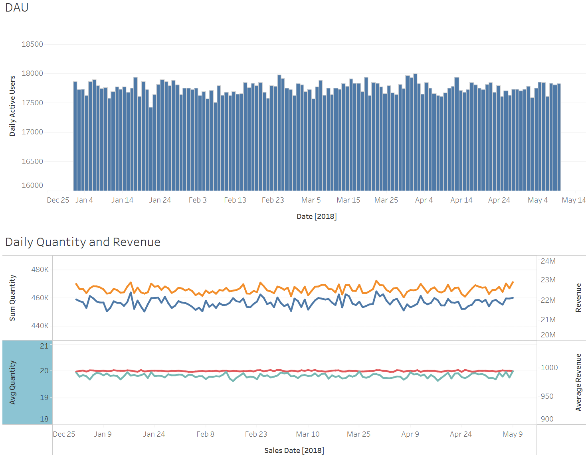
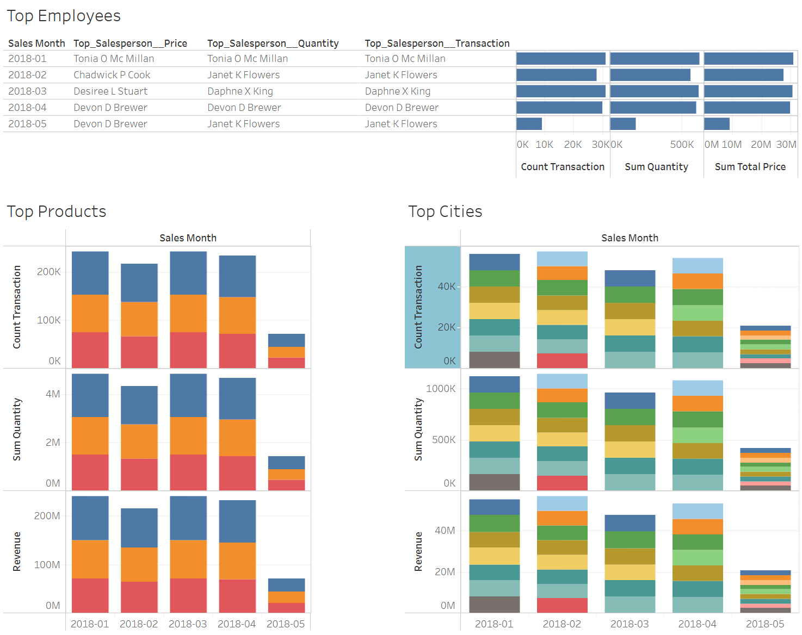
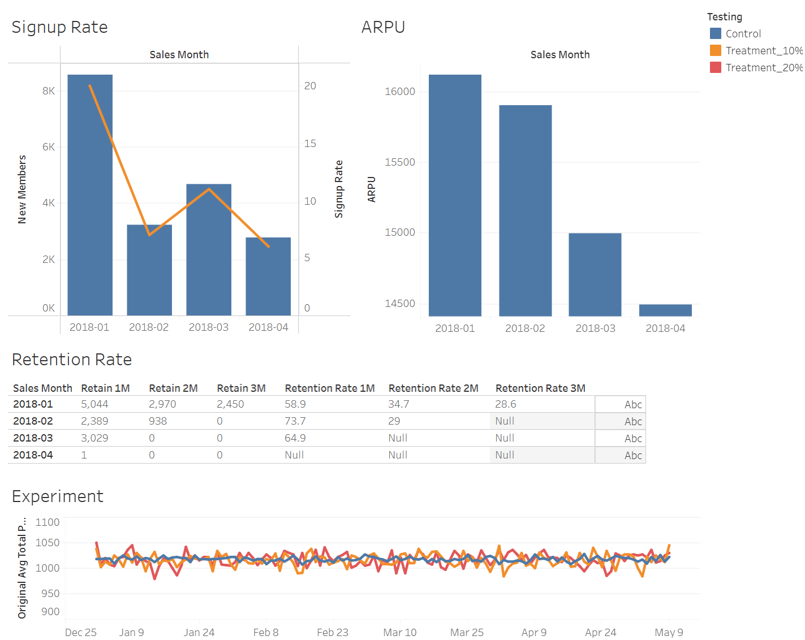

# Sales Analytics

This repository contains a sales analytics project. The data source and result dashboard are provided below.

Data source: [grocery sales dataset](https://www.kaggle.com/datasets/andrexibiza/grocery-sales-dataset)

Dashboard: [Tableau](https://public.tableau.com/app/profile/rendy.k/viz/SalesAnalytics_17459992099070/Dashboard1#1)

The file 01_data_analytics.ipynb contains the queries doing the analytics of grocery sales.

The dashboard containing the result can be seen below.

The signup rate measures the rate of customers who signed up as members. Assume that the condition to be a member is to create more than 400 transactions in a month. Then, in the next 1 month, the minimum transaction is more than 300 to maintain the membership. But, it requires more than 400 transactions again for the rest of the month.

Average Revenue Per User (ARPU) is analyzed based on the members' signup month. The ARPU of members who signed up earlier was higher.

The retention rate is analyzed based on the members' signup month. Despite having the highest ARPU, members who signed up in January 2018 had the lowest retention rate.

There was an experiment to test if giving a discount can increase the revenue (calculated based on the original prices before the discount). There were 3 groups: (1) the control group which did not receive the discount, (2) the treatment group which received a 10% discount, and (3) the treatment group which received a 20% discount. The chart showed that the discount did not affect the increase in purchase values.

